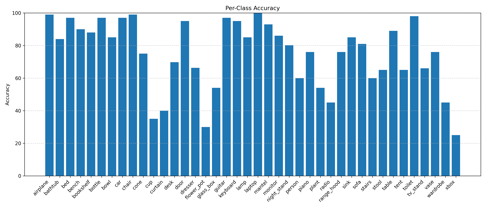
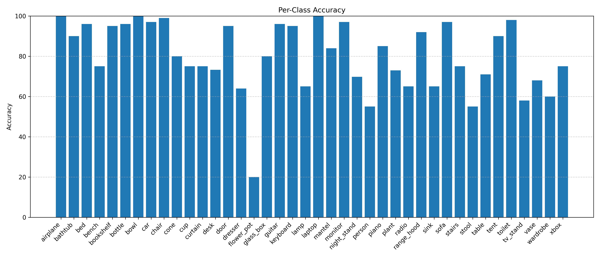
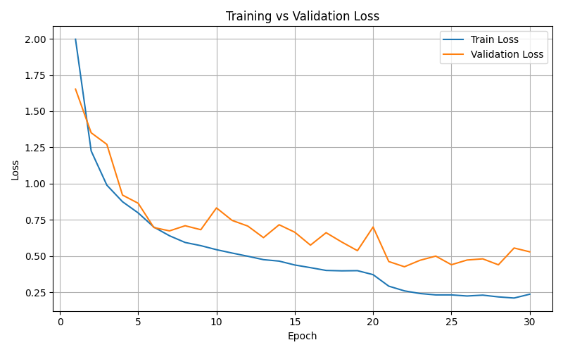

# PointNet 3D Object Classification

PyTorch implementation of **PointNet** for 3D point cloud classification on the **ModelNet40** dataset.

## 📌 Overview

This project implements PointNet, a neural network architecture designed to directly process raw 3D point clouds without voxelization or rendering.

Key components include:
- Input and feature transformation networks (T-Net)
- Shared MLPs with global max pooling
- Feature transform regularization
- Per-class accuracy and confusion matrix evaluation

## 🏗 Model Architecture

The model follows the original PointNet design:
- **Input T-Net** (3×3 affine transformation)
- **Shared MLPs** implemented using 1D convolutions
- **Feature T-Net** (64×64 feature alignment)
- **Symmetric max pooling** for global feature aggregation
- **Fully connected classifier**

A regularization term encourages the feature transformation matrix to be close to orthogonal.

## 📂 Dataset

- **Dataset**: ModelNet40  
- **Classes**: 40  
- **Input**: Point clouds uniformly sampled from mesh surfaces  
- **Points per sample**: 1024  

**Data split**:
- Training: Official ModelNet40 train split  
- Validation: Stratified split from training data  
- Test: Official ModelNet40 test split  

## 🔧 Dataset Preprocessing

Some `.off` files in ModelNet40 contain malformed headers that cannot be read by Open3D.

To fix this, the following script is provided:
- **`datasets/fix_off_header.py`**

This script converts OFF headers to a standard format compatible with Open3D.

⚠️ Run **only once before training**:

```bash
python datasets/fix_off_header.py
```

## 📊 Data Splitting Strategy

Initial experiments using PyTorch’s `random_split` resulted in uneven class distributions and degraded performance for some classes.

To address this, a custom **stratified splitting function** was implemented:
- **`split_data`** in `utils/data_utils.py`

This ensures balanced class distribution across training and validation sets and improves per-class accuracy stability.

## 📊 Evaluation

The following metrics are reported:
- Overall classification accuracy
- Per-class accuracy
- Confusion matrix

## 📈 Results and Analysis

- **Overall Test Accuracy**: **83.83%**
### Per-Class Accuracy Comparison

We compare per-class classification accuracy using two different data splitting strategies:

- **PyTorch random_split**
- **Custom stratified split**

#### PyTorch `random_split`


#### Custom Stratified Split


The random split leads to uneven class distribution in the validation set, causing
significant performance degradation for some classes.
The stratified split improves class balance and results in more stable per-class accuracy.


## 📉 Training Curves
The following plots show the training and validation loss during model training.



## 📓 Jupyter Notebook (Step-by-Step Walkthrough)

A step-by-step notebook is provided for learning and debugging:
- **`notebooks/pointnet-classification.ipynb`**

It demonstrates the full pipeline from data loading to training and evaluation.

## 📚 Reference

Qi et al., *PointNet: Deep Learning on Point Sets for 3D Classification and Segmentation*, CVPR 2017.

